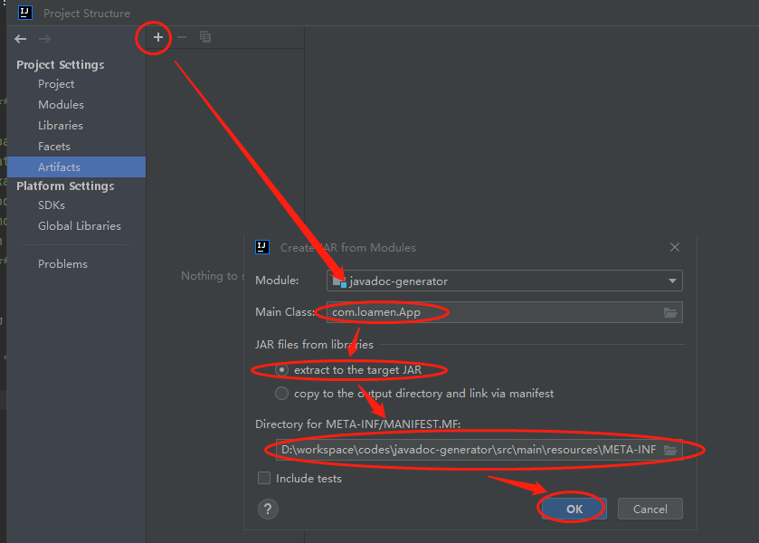

# javadoc-generator
使用Javadoc生成word版本文档，多用于详细设计文档。

测试项目代码：<https://github.com/loamen/javadoc-test>

## 参数说明

```
***********************Javadoc生成器*************************
* -source         某个java源文件或包名，可空                 *
* -sourcepath     src/main/java源文件路径，非空。            *
* -classpath      类路径，可空。                             *
* -subpackages    是否递归处理所以子包，可空。                *
* -fieldmodifier  需要处理的类字段可见性，非空。              *
* -methodmodifier 需要处理的类方法可见性，非空。              *
* -docpath        Word文档输出目录绝对路径，非空.             *
*************************************************************
```

## Program arguments

> -source "com.loamen.javadoctest" -sourcepath "..\javadoc-test\src\main\java" -subpackages "com.loamen.javadoctest" -classpath "..\javadoc-test\target\classes" -fieldmodifier PUBLIC -methodmodifier PUBLIC -docpath "d:\doc.docx"

## 打包

* 打开"File"->"Project Structure"->"Artifacts"->"+"->"JAR"->"from modules with dependence"；
* 如下图设置
  
* 打包："Build"->"Build Artifacts"，打包成功后的文件在"out\artifacts\javadoc_generator_jar"目录。