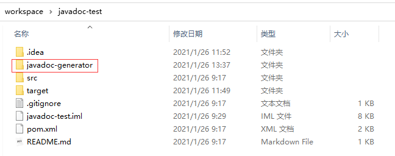
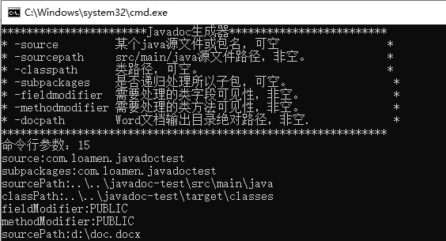

# JAVADOC生成工具使用说明

## 1.简介

根据Java项目生成Javadoc的Word版本，注释需使用标准javadoc注释。

## 2.参数说明

|  参数   | 说明  |
|  ----  | ----  |
| -source          | 某个java源文件或包名，可空。如：“com.loamen.javadoctest”。 |
| -sourcepath      | src/main/java源文件路径，非空。 |
| -classpath       | 类路径，可空。如：“\target\classes”。 |
| -subpackages     | 是否递归处理所以子包，可空。如：“com.loamen.javadoctest”。 |
| -fieldmodifier   | 需要处理的类字段可见性，非空。“PUBLIC”或“PRIVATE”。 |
| -methodmodifier  | 需要处理的类方法可见性，非空。“PUBLIC”或“PRIVATE”。 |
| -docpath         | Word文档输出目录绝对路径，非空。如：“d:\doc.docx”。 |

## 3.使用方法

“javadoc-test”是一个demo，类和方法采用javadoc标准注释。源码地址：<https://github.com/loamen/javadoc-test>

### 3.1 方法一

* 将“javadoc-generator”文件夹拷贝到Java演示工程“javadoc-test”的根目录；

* 进入“javadoc-generator”目录，编辑“.cmd”或者“.sh”的相关运行参数后保存；
* 运行“.cmd”或者“.sh”，生成文档到指定目录。

### 3.2 方法二

* 控制台进入到“javadoc-generator”文件夹，运行“java -jar javadoc-generator.jar”，并按提示步骤输入相应的运行参数即可；
